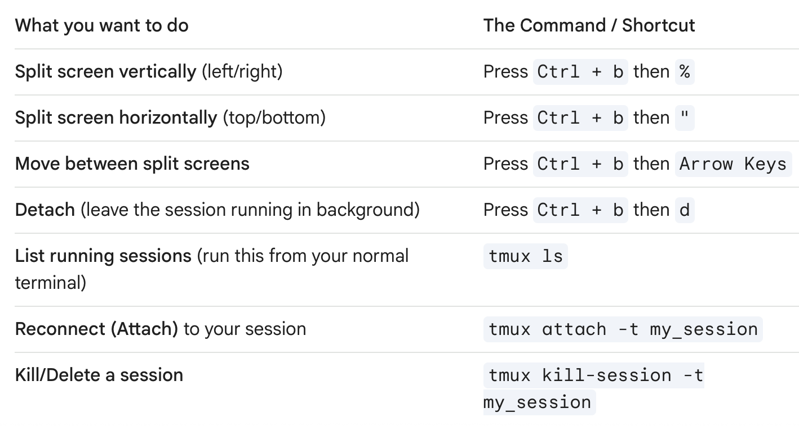

# Intro
* This file is meant to help keep track of all the stuff I do when I follow the NERA documentation and try to use its gitlab for myself to mess around with stuff in Phenix.

* Different tmux commands for navigating the terminal:

# Cloning Nera
* Do all of this on your igor node!!!

* First you need to clone the repository of the Phenix topology:
  * https://gitlab.range.nrel.gov/cyberrange/phenix/topologies
* Once that is done, you should check to see if nera is up to date.
* Move into topologies
  * If you have not checked once yet, you need to run this command instead to build it first!
    * git submodule update --init --recursive
  * If it is built run this:
    * git pull --recurse-submodules
* Then run this command inside topologies
  * ./workflow -d nera
* Now there should be a nera experiment in the experiments tab in Phenix
  * Once in the experiment, wait about 10 minutes for everything to initialize properly.
  * Once all the screens look stable, then you can start verifying that stuff is working.

## Authentication Chain
* I don't know why, but I can't get any of the stuff to authenticate for this, it takes too long to load properly.
* Go into the RMT-ws machine
* You should see a KeePassXC window and an OpenVPN client window.

# Scorch Commands
* Run this command in the phenix docker container to execute the python script that builds the threat payload for the basic example 0 scenario:
  * python3 /phenix/nera/scorch/example-mythic-c2/generate-host-payload.py
* Need to install Mythic first!!