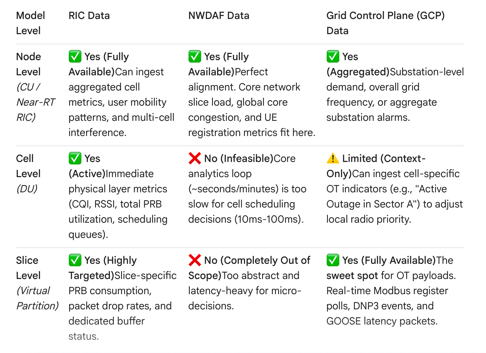

# Goals for Today
* Write an Introduction for my research paper.
* Start putting together presentation for managers.
* Look into new features that Josh has gotten up and working.

# Notes

                                  +---------------------------------------+
                                  |         SMO / Non-RT RIC              |  <- Global FL Server
                                  |    (Global Aggregator / rApps)        |     (Time: > 1 sec)
                                  +---------------------------------------+
                                                      ^
                                                      | Model Updates (S-NSSAI / Cell Metrics)
                                                      v
                                  +---------------------------------------+
                                  |          Near-RT RIC / CU             |  <- Node-Level FL Server
                                  |          (Node-Level xApps)           |     (Time: 10ms - 1s)
                                  +---------------------------------------+
                                       /              |              \
               +----------------------+               |               +----------------------+
               |                                      |                                      |
               v                                      v                                      v
      +------------------+                  +------------------+                  +------------------+
      |      Cell 1      |                  |      Cell 2      |                  |      Cell 3      |  <- Cell-Level FL Client
      |   (DU Metrics)   |                  |   (DU Metrics)   |                  |   (DU Metrics)   |
      +------------------+                  +------------------+                  +------------------+
         /     |     \                         /     |     \                         /     |     \
        v      v      v                       v      v      v                       v      v      v
     +---+  +---+  +---+                   +---+  +---+  +---+                   +---+  +---+  +---+
     |S1 |  |S2 |  |S3 |                   |S1 |  |S2 |  |S3 |                   |S1 |  |S2 |  |S3 |  <- Slice-Level Local Models
     +---+  +---+  +---+                   +---+  +---+  +---+                   +---+  +---+  +---+     (Dedicated KPIs / PRBs)

+-----------------------------------------------------------------------------+
|                          GRID CONTROL PLANE (OT Plane)                      |
|  * Manages Substations, Phasor Measurement Units (PMUs), GOOSE/DNP3 traffic |
+-----------------------------------------------------------------------------+
                                      |  (Requires ultra-low latency)
                                      v  
+-----------------------------------------------------------------------------+
|                         5G CORE PLANE (NWDAF)                               |
|  * Analyzes overall slice health (eMBB vs. uRLLC), core load, user mobility |
+-----------------------------------------------------------------------------+
                                      |  (Provides analytical insights/policies)
                                      v
+-----------------------------------------------------------------------------+
|                          RAN PLANE (RIC)                                    |
|  * Allocates PRBs, optimizes beamforming, handles radio cell congestion     |
+-----------------------------------------------------------------------------+

* Command to capture data from tshark and save it to the json file for data analysis (GCP data):
  * sudo tshark -i rfsim5g-traffic \
  -Y "tcp.port == 502 or tcp.port == 20000 or udp.port == 20000 or eth.type == 0x88b8" \
  -T json \
  -e frame.time_epoch \
  -e ip.src \
  -e ip.dst \
  -e frame.len \
  -e ip.proto \
  -e modbus.func_code \
  -e dnp3.al.func \
  -e goose.appid \
  > ~/badgers-based-lab/jupyterlab/tf-lab/notebooks/db_dir/traffic.json

# What I did Today
* Worked on introduction for research paper.
* Worked on powerpoint for federated learning.
* Debugged simulation for real-world data with Josh.